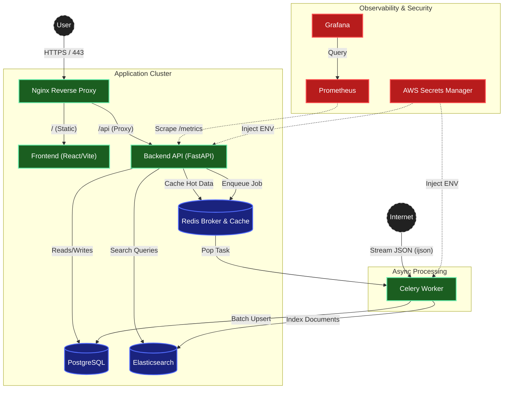

```mermaid
graph TD
    %% Users and External Entry
    User((User)) -->|"HTTPS / 443"| Nginx["Nginx Reverse Proxy"]
    Internet((Internet)) -->|"Stream JSON (ijson)"| Celery["Celery Worker"]

    %% The Application Layer
    subgraph "Application Cluster"
        Nginx -->|"/ (Static)"| Frontend["Frontend (React/Vite)"]
        Nginx -->|"/api (Proxy)"| Backend["Backend API (FastAPI)"]
        
        %% Dependencies
        Backend -->|"Reads/Writes"| DB[("PostgreSQL")]
        Backend -->|"Cache Hot Data"| Redis[("Redis Broker & Cache")]
        Backend -->|"Search Queries"| ES[("Elasticsearch")]
    end

    %% The Background Processing Layer
    subgraph "Async Processing"
        Backend -->|"Enqueue Job"| Redis
        Redis -->|"Pop Task"| Celery
        
        Celery -->|"Batch Upsert"| DB
        Celery -->|"Index Documents"| ES
        
        %% (Future Improvement: Dead Letter Queue)
        %% Celery -.->|"Parse Failures"| DLQ["Dead Letter Queue"]
    end

    %% Observability & Security (The Senior Engineer Additions)
    subgraph "Observability & Security"
        Prometheus[Prometheus] -.->|"Scrape /metrics"| Backend
        Grafana[Grafana] -->|"Query"| Prometheus
        
        Secrets["AWS Secrets Manager"] -.->|"Inject ENV"| Backend
        Secrets -.->|"Inject ENV"| Celery
    end

    %% Styling - Dark Mode / High Contrast
    classDef storage fill:#1a237e,stroke:#536dfe,stroke-width:2px,color:#fff;
    classDef component fill:#1b5e20,stroke:#69f0ae,stroke-width:2px,color:#fff;
    classDef security fill:#b71c1c,stroke:#ff5252,stroke-width:2px,color:#fff;
    classDef external fill:#212121,stroke:#e0e0e0,stroke-width:2px,stroke-dasharray: 5 5,color:#fff;

    class DB,Redis,ES,DLQ storage;
    class Backend,Frontend,Celery,Nginx component;
    class Secrets,Prometheus,Grafana security;
    class User,Internet external;
```